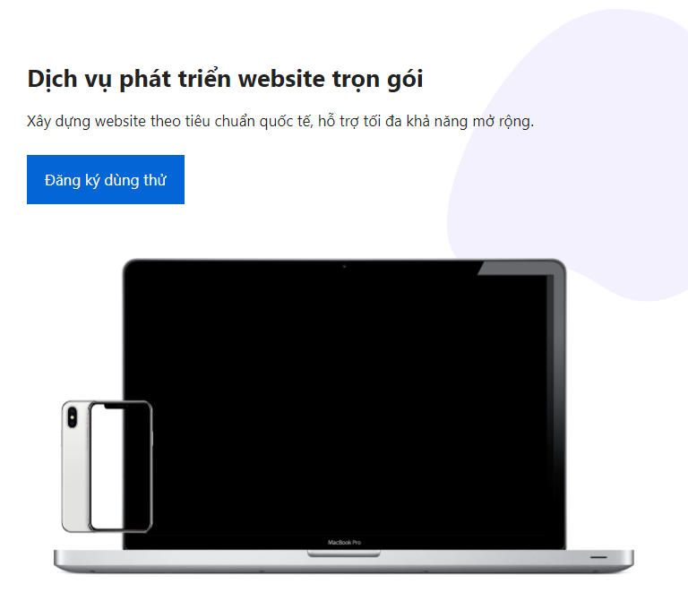

# Vanilla Gutenberg Blocks

Craft Gutenberg blocks is not easy if you don't use Webpack or any Javascript. We know it's required skill to do that, however sometimes we just need a great layout with content, such as normal landing pages. This repository contains some of best blocks we made, with or without plugins.

## Available Blocks

- Hero Homepage

## How to use?

- Change a editor mode to Code Editor
- Paste your block Html markup.
- Go to Customizer > Custom CSS, place block CSS.
- Replace image (if it is available in block) with your media or download from same directory.

**Enjoy Gutenberg!**
